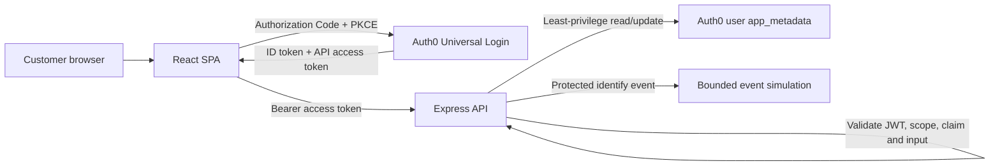

# Pizza 42 identity proof of concept

Pizza 42 is a security-focused Auth0 proof of concept for a customer ordering journey. It combines a React single-page application, an Express API, a tested Auth0 Post-Login Action, and a protected marketing-event simulation. The implementation is intentionally small enough to review end to end: every trust decision has a direct test or a documented hosted validation step.

## What it proves

- Universal Login supports the database and Google connection paths without handling credentials in Pizza 42 code.
- Customers may sign in before verifying email, while the API blocks ordering until a fresh access token contains the verified claim.
- The API validates RS256 signature, issuer, audience, expiry, and operation-specific scope.
- The browser submits only SKU and quantity; the API owns the catalogue, resolves prices, and calculates totals.
- Successful orders are appended to Auth0 `app_metadata.orders` using a least-privilege Management API client.
- A Post-Login Action adds order history and a derived customer profile to namespaced ID-token claims.
- A protected, customer-scoped endpoint produces a Segment-shaped demonstration event without making ordering depend on a marketing destination.

The requirements-to-evidence mapping is in [docs/requirements.md](docs/requirements.md).

## Architecture



The browser expresses intent. The API establishes authority. ID tokens provide client identity context and are never accepted as API authorization; access tokens are kept in memory and raw token values are deliberately absent from the UI.

See [docs/architecture.md](docs/architecture.md) for the full trust-boundary walkthrough.

## Repository map

```text
auth0/  Post-Login Action, tests, and repeatable tenant checklist
api/    Express API, domain rules, Auth0 Management API adapter, and tests
web/    React/Vite SPA, local visual preview, and interaction tests
docs/   requirements, architecture, decisions, limitations, and evidence matrix
```

## Run locally

Node.js 22 is required. The repository is an npm workspace with a committed lockfile.

```bash
nvm use
npm ci
cp api/.env.example api/.env
cp web/.env.example web/.env
```

Populate the two local environment files from a test tenant configured with [auth0/tenant-config.md](auth0/tenant-config.md). Never prefix a secret with `VITE_`; Vite values are public browser configuration.

Start the API and SPA in separate terminals:

```bash
npm run dev --workspace @pizza42/api
npm run dev --workspace @pizza42/web
```

The API defaults to `http://localhost:8080`; Vite serves the SPA at `http://localhost:5173`.

## Verification

The same gates run in pull requests:

```bash
npm run format:check
npm run lint
npm run test:coverage
npm run build
npm audit --omit=dev --audit-level=high
```

The tests use a local OIDC discovery endpoint, local JWKS, and RSA-signed JWTs. This exercises the real bearer-token middleware for missing tokens, wrong audience, expiry, missing scope, user isolation, and verified-email enforcement instead of replacing authentication with a permissive stub.

## Security posture

The server applies Helmet headers, an exact CORS allowlist, bounded JSON bodies, API rate limiting, strict order schemas, safe JSON error contracts, subject-scoped reads, and server-authoritative pricing. Management API credentials stay server-side, token acquisition is cached before expiry, and the requested permissions are limited to `read:users` and `update:users_app_metadata`.

Report suspected vulnerabilities privately as described in [SECURITY.md](SECURITY.md). Internal briefing documents, real customer data, credentials, tokens, and tenant exports must never be committed.

## POC versus production

Two challenge requirements are deliberately unsuitable as a long-term design: Auth0 profile metadata is not a transactional order store, and a full order history should not grow inside an ID token. Production would use a domain datastore, atomic writes, bounded identity claims, distributed rate limiting, and an asynchronous event pipeline for downstream marketing tools.

These and other explicit boundaries are in [docs/known-limitations.md](docs/known-limitations.md).

## Status

| Workstream                 | Local implementation         | Hosted evidence           |
| -------------------------- | ---------------------------- | ------------------------- |
| Repository controls and CI | Complete                     | Runs after branch push    |
| Auth0 Post-Login Action    | Tested                       | Tenant deployment pending |
| Orders and profile API     | Tested                       | Tenant smoke test pending |
| React ordering journey     | Tested and visually reviewed | Hosted smoke test pending |
| Marketing demonstration    | Tested                       | Hosted smoke test pending |

No hosted result is claimed until the corresponding row in [docs/test-matrix.md](docs/test-matrix.md) has evidence.

## Project references

- [Tenant configuration](auth0/tenant-config.md)
- [Requirements traceability](docs/requirements.md)
- [Architecture and trust boundaries](docs/architecture.md)
- [Design system](DESIGN.md)
- [Design decisions](docs/design-decisions.md)
- [Known limitations](docs/known-limitations.md)
- [Test matrix](docs/test-matrix.md)
- [Contributing](CONTRIBUTING.md)
