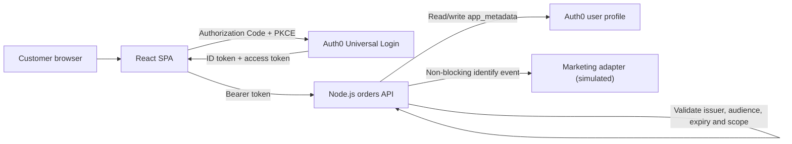

# Pizza 42 identity proof of concept

Pizza 42 is replacing a home-grown customer identity service used by its web ordering experience. This repository will contain a working Auth0 proof of concept: a React single-page application, a Node.js API, Auth0 tenant configuration, and the evidence needed to explain the security model and its trade-offs.

The first commit establishes the contracts and delivery guardrails before implementation begins. That is deliberate. Authentication demos are easy to make look convincing while leaving important checks in the browser or hiding production caveats. This project treats those checks as part of the design.

## What the POC must prove

- Customers can sign up or sign in with a database account or Google.
- Signing in does not require a verified email address, but placing an order does.
- The orders endpoint rejects missing, invalid, or incorrectly scoped access tokens.
- Menu prices are calculated by the API, not trusted from the browser.
- A successful order is written to the user's Auth0 `app_metadata` for the exercise.
- Order history is added to the ID token at login, as required by the brief.
- Customer context can be shaped for a downstream marketing integration without making checkout depend on the marketing platform.

The full traceability matrix is in [docs/requirements.md](docs/requirements.md).

## Target architecture



The browser expresses what the customer wants to buy. The API establishes whether the caller may order and calculates the authoritative total. Credentials are entered only in Universal Login and never pass through Pizza 42 application code.

See [docs/architecture.md](docs/architecture.md) for trust boundaries and token use.

## Planned repository structure

```text
auth0/   tenant notes and Post-Login Action source
api/     Express API and Management API integration
web/     React and Vite single-page application
scripts/ repeatable seed, failure-path, and smoke tests
docs/    architecture, decisions, limitations, and test evidence
```

The application folders will be added in vertical slices. Each slice must include its tests and documentation rather than landing as an unverified scaffold.

## Security model

The API, not the UI, enforces the controls that protect ordering:

1. Validate the JWT signature through the tenant JWKS.
2. Check issuer, audience, expiry, and the `create:orders` permission.
3. Require the namespaced verified-email claim.
4. Validate menu item identifiers and quantities against a server-side catalogue.
5. Use a least-privilege machine-to-machine client to update `app_metadata`.

Secrets are not committed. Each application will provide an `.env.example` containing names and safe placeholders only. If you find a security issue, follow [SECURITY.md](SECURITY.md) rather than opening a public issue.

## POC and production are different

Two requirements are intentionally implemented in a way that should not be copied into production: Auth0 profile metadata is used as the order store, and the full order history is placed in an ID token. Both choices satisfy the exercise, but neither scales with order volume. A production service would keep order data in a transactional datastore and issue bounded identity claims.

Other limits, including the non-atomic metadata update and simulated marketing destination, are tracked in [docs/known-limitations.md](docs/known-limitations.md).

## Current status

Repository foundation and shared contracts are in place. No application functionality is claimed yet. Test results will move from `Not run` to `Pass` only when the corresponding path is working in the hosted environment.

| Workstream | Status |
| --- | --- |
| Shared contracts and repository controls | Complete |
| Auth0 tenant and Post-Login Action | Not started |
| Orders API | Not started |
| React SPA | Not started |
| Marketing demonstration | Not started |
| Hosted smoke tests | Not started |

## Working on the repository

Changes are made on short-lived branches and merged through pull requests. Keep commits narrow, include a test or explicit validation note, and update the relevant decision or limitation when behaviour changes. [CONTRIBUTING.md](CONTRIBUTING.md) records the working agreement.

## Documentation

- [Requirements traceability](docs/requirements.md)
- [Architecture and trust boundaries](docs/architecture.md)
- [Design decisions](docs/design-decisions.md)
- [Known limitations](docs/known-limitations.md)
- [Test matrix](docs/test-matrix.md)

