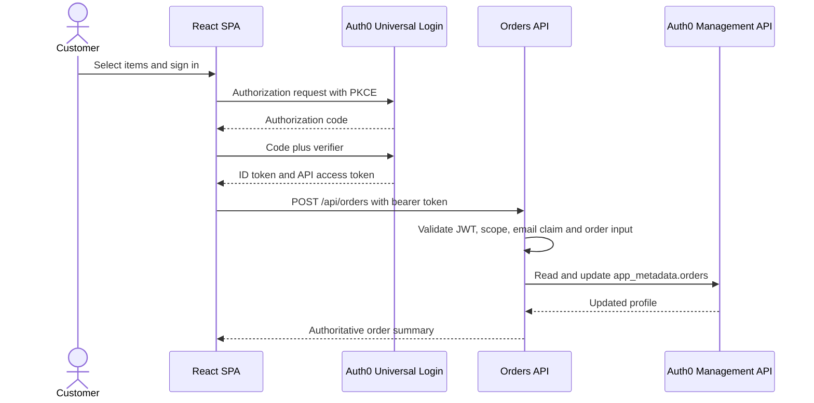

# Architecture and trust boundaries

## System context

The POC has four execution boundaries: the browser, Auth0, the Pizza 42 API, and an optional marketing destination. The SPA is public client code. It holds no client secret and is never trusted to make authorization or pricing decisions.

## Token roles

The access token authorizes calls to the Pizza 42 API. The API checks its signature, issuer, audience, expiry, and `create:orders` permission. The ID token tells the SPA about the signed-in customer and carries the exercise-specific order-history and customer-profile claims. An ID token is not accepted as API authorization.

Custom claims use a collision-resistant HTTPS namespace. The exact namespace will be frozen with the tenant name before application code is merged.

## Ordering boundary

The client sends item identifiers and quantities. The API looks up each item in its own catalogue and calculates the total. This prevents a modified browser request from setting a lower price. The API also rejects unknown items, invalid quantities, a stale or unverified email claim, and tokens without the required permission.

## Auth0 profile access

The orders service uses a machine-to-machine credential with `read:users` and `update:users_app_metadata`, not broad `update:users`. The token is cached in memory until shortly before expiry. Secrets remain in the API environment and are never returned to the SPA or written to logs.

## Marketing path

The POC will expose a protected, clearly labelled simulation of the customer context sent to a marketing tool. The production design is asynchronous: Auth0 login signals and Pizza 42 domain events flow through an event bus or supported log stream, then into Segment or Braze. Login and checkout must continue if those systems are unavailable.

## Production migration

The current identity store uses salted SHA-256 password hashes and cannot force two million password resets. The migration design must test two supported paths before choosing one:

- bulk import, if the existing hash format and parameters can be represented safely;
- automatic migration through a custom database connection, where the first successful legacy login moves the user to Auth0.

The proof of concept documents both paths but does not move real customer records.
