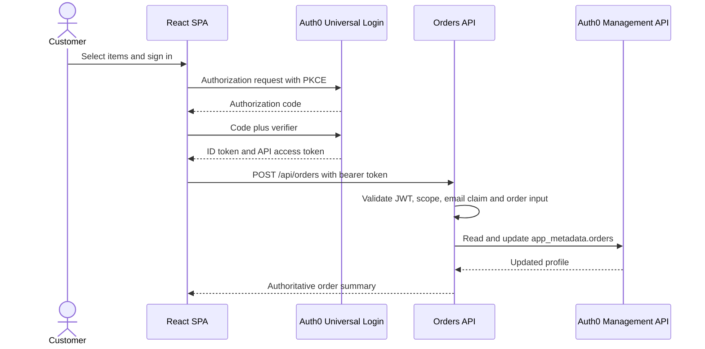

# Architecture and trust boundaries

## System context

The POC has four execution boundaries: the browser, Auth0, the Pizza 42 API, and an optional marketing destination. The SPA is public client code. It holds no client secret and is never trusted to make authorization or pricing decisions.

## Token roles

The access token authorizes calls to the Pizza 42 API. The API checks its signature, issuer, audience, expiry, and `create:orders` permission. The ID token tells the SPA about the signed-in customer and carries the exercise-specific order-history and customer-profile claims. An ID token is not accepted as API authorization.

The ID token is a signed statement about the customer at the moment of login, so it cannot describe an order placed since. The storefront's "Recent orders" list therefore reads `GET /api/orders` under `read:orders`, and the order-history claim is displayed separately in the Behind the counter panel as the requirement 10 artefact. Both counts are shown together deliberately: they diverge after an order and agree again after the next login, which is the clearest available demonstration that identity carries assertions rather than live application state.

The panel's Insight tab makes the same point trait by trait, showing the profile the Post-Login Action signed into the ID token beside the profile the API derives live, and marking the rows that have moved. Divergence there is the expected behaviour being demonstrated, not a fault being reported.

Custom claims use the collision-resistant HTTPS namespace `https://pizza42.com/`, frozen in [../CONTEXT.md](../CONTEXT.md) and shared by the Action, the API and the SPA.

## Ordering boundary

The client sends item identifiers and quantities. The API looks up each item in its own catalogue and calculates the total. This prevents a modified browser request from setting a lower price. The API also rejects unknown items, invalid quantities, a stale or unverified email claim, and tokens without the required permission.

## Auth0 profile access

The orders service uses a machine-to-machine credential with `read:users` and `update:users_app_metadata`, not broad `update:users`. The token is cached in memory until shortly before expiry. Secrets remain in the API environment and are never returned to the SPA or written to logs.

## Marketing path

The POC exposes `POST /api/marketing/identify` and `GET /api/marketing/events` behind the same access-token validation and `read:orders` permission. The server ignores browser-supplied traits, reads the current token subject's order history, derives a Segment-shaped identify event, and keeps a bounded in-memory demonstration history. Reads are filtered by the access-token subject.

The SPA invokes the simulation independently of menu loading and checkout and treats failure as non-blocking. The production design is asynchronous: Pizza 42 domain events flow through an event bus or supported Auth0 log stream, then into Segment or Braze. Login and checkout continue if those systems are unavailable.

## Published configuration

`GET /api/meta` is public and unauthenticated. It returns the issuer and
audience this deployment accepts, the signing algorithm, the scope required per
operation, the claim namespace, the claim and route where verified email is
enforced, and the order quantity ceilings.

None of it is secret. Every value is already visible in any token the tenant
issues or in a rejection this API returns, and an OIDC provider publishes the
equivalent at its discovery endpoint. What it buys is that a reviewer with a
token can compare the audience it carries against the audience this deployment
enforces without being handed a tenant dashboard login, and that the published
quantity ceiling is read from the same constant the order schema enforces
rather than being a number in a document that can drift. A test asserts both:
that the published ceiling is the enforced ceiling, and that the payload
carries no credential.

It is read with `curl`, not by the application. No browser code calls it.

## HTTP boundary controls

The API applies security headers, an exact CORS origin allowlist, a 16 KiB JSON body limit, process-local request limiting, strict schemas, and safe JSON errors. These controls reduce accidental exposure and common abuse but do not replace edge rate limiting, monitoring, or a web application firewall in production.

The SPA is served with its own headers from [../web/vercel.json](../web/vercel.json): a Content Security Policy, HSTS, `nosniff`, `frame-ancestors 'none'`, a referrer policy and a Permissions-Policy denying device APIs the storefront never uses. The policy is deliberately not the strictest expressible one. `auth0-spa-js` creates a Web Worker from a `blob:` URL to hold refresh tokens off the main thread, and restores sessions through a hidden iframe against the tenant's `/authorize`, so `worker-src 'self' blob:` and `frame-src` for the tenant are required. A policy without them breaks authentication silently, which is worse than no policy at all — the storefront still renders, and only the session quietly fails. The Auth0 domain and the API origin are literals in that file because Vercel does not expand environment variables in header values; changing either deployment target means changing the policy in the same commit.

## Production migration

The current identity store uses salted SHA-256 password hashes and cannot force two million password resets. The migration design must test two supported paths before choosing one:

- bulk import, if the existing hash format and parameters can be represented safely;
- automatic migration through a custom database connection, where the first successful legacy login moves the user to Auth0.

The proof of concept documents both paths but does not move real customer records.
